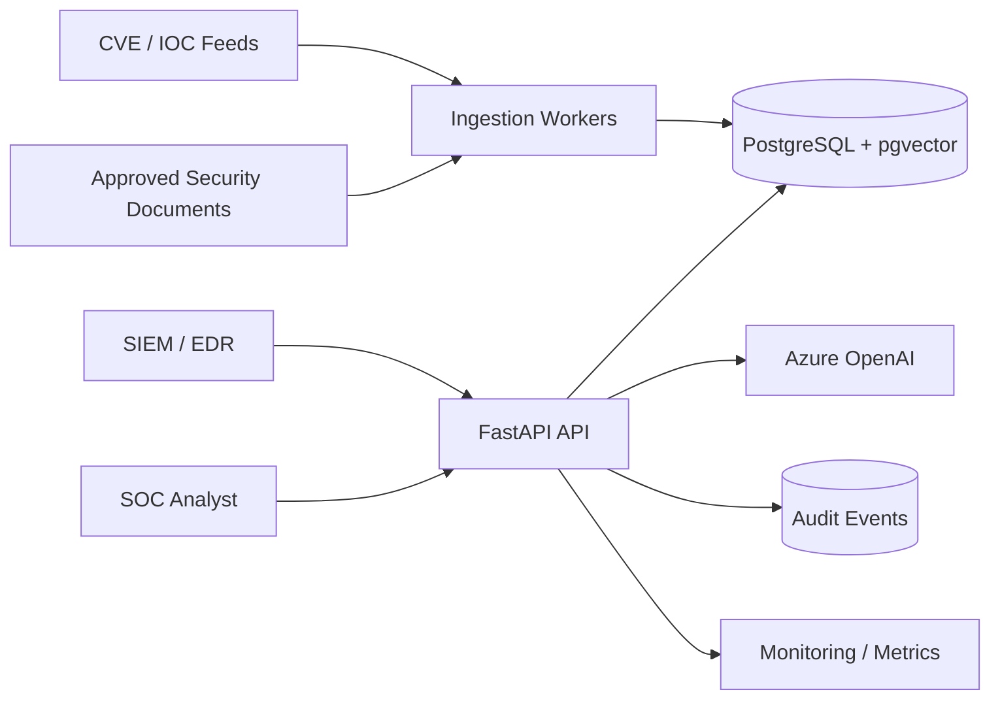
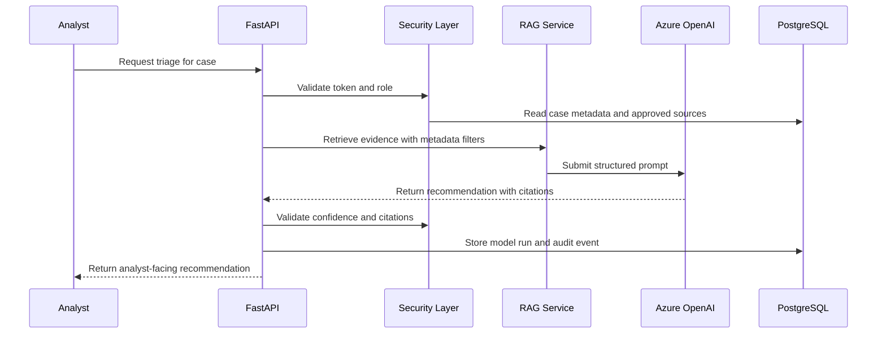

# Data Flow and Sequence Diagrams

## High-Level Data Flow

```mermaid
flowchart LR
    SIEM["SIEM / EDR"] --> API["FastAPI API"]
    FEEDS["CVE / IOC Feeds"] --> WORKERS["Ingestion Workers"]
    DOCS["Approved Security Documents"] --> WORKERS
    WORKERS --> DB[("PostgreSQL + pgvector")]
    API --> DB
    API --> LLM["Azure OpenAI"]
    API --> AUD[("Audit Events")]
    API --> MON["Monitoring / Metrics"]
    ANALYST["SOC Analyst"] --> API
```

## Triage Sequence

```mermaid
sequenceDiagram
    participant A as Analyst
    participant API as FastAPI
    participant SEC as Security Layer
    participant RAG as RAG Service
    participant LLM as Azure OpenAI
    participant DB as PostgreSQL

    A->>API: Request triage for case
    API->>SEC: Validate token and role
    SEC->>DB: Read case metadata and approved sources
    API->>RAG: Retrieve evidence with metadata filters
    RAG->>LLM: Submit structured prompt
    LLM-->>API: Return recommendation with citations
    API->>SEC: Validate confidence and citations
    API->>DB: Store model run and audit event
    API-->>A: Return analyst-facing recommendation
```

