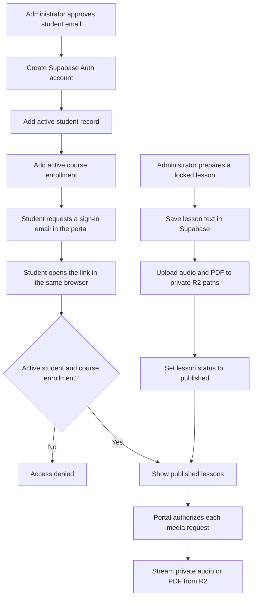

# Ruach Institute — administration guide

This guide describes the portal as implemented on September 16, 2026. Supabase holds the student roster, enrollment permissions and lesson text. Cloudflare R2 holds the audio and PDFs. Administration currently uses these dashboards and the local helper; there is no admin page inside the student portal.

The portal is running locally at <http://127.0.0.1:8765/institute/>. Production deployment at `ruach.zionencounter.com/institute` is still separate work. Public signup is disabled: every student must be added by an administrator.

## Workflow map



Uploading a file does not publish its lesson. A student needs an Auth account, an active student record, an active enrollment and an active course. The lesson must also be published.

## Where to work

| Task | Location |
| --- | --- |
| View login identities or delete a login account | [Supabase → Authentication → Users](https://supabase.com/dashboard/project/ifdxetyjedfrhhpkzdza/auth/users) |
| Edit student access, enrollments and lesson text | [Supabase → Table Editor](https://supabase.com/dashboard/project/ifdxetyjedfrhhpkzdza/editor), select schema **institute** |
| Run the prepared enrollment transaction | [Supabase → SQL Editor](https://supabase.com/dashboard/project/ifdxetyjedfrhhpkzdza/sql) |
| Upload, replace or delete media | [Cloudflare dashboard](https://dash.cloudflare.com/88d5bb882b0283a5f342cf3aa0b2549e/home) → **R2 Object Storage** → **ruach-institute-media** |
| Change email wording | Supabase → Authentication → Emails → Templates → Magic Link |

The tables you administer are `institute.students`, `institute.enrollments`, `institute.courses` and `institute.lessons`. Do not run the initial migration again; this project is already configured.

## 1. Add a student

Have the approved email, a unique student ID such as `RI-002`, and the course ready. The existing test student is `RI-TEST-001`; do not recreate it.

1. In Authentication → Users, search for the email. Reuse an existing account if one exists.
2. For a new account, open Terminal and run the existing passwordless provisioning helper:

   ```sh
   cd '/Users/davidpath/Documents/New project'
   .venv/bin/python -m scripts.institute.create_auth_user
   ```

3. Enter the approved email. At the hidden prompt, paste the project's **legacy service-role key**, available to a project administrator under Project Settings → API Keys → Legacy keys. This privileged key stays in the local helper's memory; do not save it in the portal's `.env`, frontend code or student instructions.
4. Open [the prepared enrollment SQL](../supabase/admin/enroll_student.sql). Copy it into Supabase SQL Editor. Replace only `REPLACE_WITH_APPROVED_EMAIL` and `REPLACE_WITH_STUDENT_ID`, then run it. This creates the active student and their active **Architecture of the Mind** enrollment together. Missing accounts and duplicates produce an error rather than overwriting a student.
5. Check the new rows in `students` and `enrollments`.
6. Give the student the portal address. They enter their email and request their own sign-in link, then open it in the same browser.

The helper does not send email or assign a password. Use the portal's login form for sign-in emails: its browser-bound callback requires the state cookie created by that form. The dashboard's generic invitation, password recovery and magic-link buttons are not the supported entry point for this portal.

For another course, reuse the student record. In `enrollments`, insert a row with the student's **internal UUID from `students.id`**, the course UUID from `courses.id`, and `status = active`. Leave enrollment `id` and `created_at` at their defaults. The `enrollments.student_id` field expects a UUID, not the visible code `RI-002`.

## 2. Edit a student

Open Table Editor → institute → students, filter by their email or visible `student_id`, edit the relevant cell or row, and save.

| Change | Action |
| --- | --- |
| Student reference code | Edit `students.student_id`; keep it unique. |
| Pause all portal access | Set `students.status` to `inactive`. |
| Restore portal eligibility | Set it back to `active`; the required enrollment must also be active. |
| Pause only one course | Find the student's matching course row in `enrollments`; set its `status` to `inactive`. |
| Restore one course | Set that enrollment's status back to `active`. |
| Add a course | Add an enrollment as described above. |
| Change email | Follow the coordinated email change below. |

Keep `students.id` and `students.auth_user_id` unchanged during routine edits. The schema currently has no student-name field. The portal identifies the student using their student ID.

### Change the sign-in email

The login address lives in Supabase Auth; `students.email` is the roster copy. Editing the roster email alone will not change where sign-in emails go.

1. Verify the replacement address with the student and check that it does not belong to another account.
2. Record the current student status, then temporarily set it to `inactive`.
3. Copy `students.auth_user_id` and update that **same** Auth account through the trusted Admin API. Do not directly edit the managed `auth.users` table. Supabase's [admin email-update operation](https://supabase.com/docs/reference/javascript/auth-admin-updateuserbyid) applies the change without a confirmation flow, so check the address carefully.
4. The following command is an administrator-only way to perform step 3 using the existing Python environment. It asks for the key privately and does not store it:

   ```sh
   cd '/Users/davidpath/Documents/New project'
   .venv/bin/python -c '
   from getpass import getpass
   from uuid import UUID
   import httpx
   from email_validator import validate_email
   from app.institute.config import get_portal_settings
   settings = get_portal_settings()
   uid = str(UUID(input("Existing auth_user_id: ").strip()))
   email = validate_email(input("Verified new email: ").strip(), check_deliverability=False).normalized.lower()
   print("Update Auth account", uid, "to", email)
   if input("Type UPDATE to apply: ") != "UPDATE":
       raise SystemExit("Cancelled")
   key = getpass("Supabase legacy service-role key: ").strip()
   response = httpx.put(
       settings.supabase_url.rstrip("/") + "/auth/v1/admin/users/" + uid,
       headers={"apikey": key, "Authorization": "Bearer " + key},
       json={"email": email, "email_confirm": True}, timeout=15,
   )
   if response.status_code != 200:
       raise SystemExit("Update not confirmed; check Authentication Users before retrying.")
   print("Auth email updated. Update the matching institute.students.email next.")
   '
   ```

5. Verify the Auth email in Authentication → Users. Update the matching `students.email` to the same lowercase address and save.
6. Restore the prior student status once both records match. Ask the student to sign out and request a fresh link using the new address. Their existing enrollment stays linked because the Auth UUID did not change.

## 3. Remove a student

For routine removal, set `students.status = inactive`. That stops subsequent authorized portal/content requests while preserving the roster and enrollments. Already delivered pages or downloaded files cannot be recalled; an in-progress stream may finish.

To permanently remove the records:

1. Set the student inactive, verify the email and visible student ID, and retain any roster information you need.
2. Copy `auth_user_id` before deleting the roster row.
3. Delete only that student's row from `institute.students`. Its enrollment rows are deleted automatically by the database relationship.
4. In Authentication → Users, open the matching Auth UUID/email and choose **Delete user**. Review the confirmation before completing it.

Deleting a student does not delete shared lessons, audio or PDFs. Deleting only the Auth account leaves a roster row with a blank `auth_user_id`; it does not clean up the roster automatically.

## 4. Add or edit lesson text

In Table Editor → institute → lessons, locate the course and week. Weeks 1–5 already exist for Architecture of the Mind, so edit those rows rather than inserting duplicates.

| Field | What appears or changes |
| --- | --- |
| `title` | Week title and audio title |
| `description` | Introduction beneath the week title |
| `notes` | Written notes on the page; separate from the PDF |
| `reflection_questions` | Reflection text |
| `status` | `locked` hides the lesson content; `published` makes it available to enrolled students |
| `week_number` | Position on the course page |
| `display_order` | Keep it equal to the week number; the page currently renders in week-number order |

To add text, replace `PLACEHOLDER`. To edit, replace the existing field value. To remove optional written content, save an empty string rather than `NULL`. An empty field still leaves its section heading visible.

These fields currently render as plain text. HTML is escaped and Markdown is not converted to formatted content. Rich text, separate question items and paragraph formatting need a template/editor enhancement.

For a staged update, set the lesson to `locked`, save text and upload files, then set it to `published` when ready. Saving changes to an already published lesson makes the new text available on the next page request; there is no separate draft version or automatic timed release.

The large course title is `courses.title`. The course-wide **Overview** paragraph is currently a literal placeholder in [course.html](../app/institute/templates/course.html), not a database field. Changing it requires a template edit and app restart/deployment; the template is shared by courses. Login text and resource headings are also in the templates.

## 5. Add a new week

1. Find the course UUID in `courses.id`.
2. Insert a row in `lessons`. Leave `id` at its generated default, set the course UUID, an unused `week_number`, `display_order` to that number, the text fields, and `status = locked`.
3. Copy the new lesson's `id` UUID for its R2 paths.
4. If extending beyond the course's existing length, increase `courses.total_weeks` so the new week is rendered. The schema permits up to 52 weeks.
5. Upload the lesson's media, finish its text and set its status to `published`.

To withdraw a week, change its status to `locked`. To delete it permanently, first copy its UUID and lock it, delete its two R2 objects if no longer needed, then delete its lesson row. Deleting the row alone does not delete R2 files. The page still shows a locked slot for a missing week within `total_weeks`; decrease `total_weeks` only when intentionally shortening the end of a course.

## 6. Add or replace audio and PDFs

Each lesson currently supports **one recording and one PDF**. The portal derives their paths from the lesson UUID; there are no editable media URL columns.

```text
ruach-institute-media/
  lessons/
    <lesson UUID>/
      audio
      notes.pdf
```

| Resource | Exact object key | Content-Type |
| --- | --- | --- |
| MP3 recording | `lessons/<lesson UUID>/audio` | `audio/mpeg` |
| PDF notes | `lessons/<lesson UUID>/notes.pdf` | `application/pdf` |

The audio object name is exactly `audio`, with **no extension**. The source file on your computer can retain its `.mp3` extension. Accepted audio types also include `audio/mp4`, `audio/wav`, `audio/x-wav` and `audio/ogg`; the metadata must match the actual file format.

Week 1's existing lesson UUID is `d9515a54-a2c6-4753-aad0-529ae9341033`. For other weeks, copy their own IDs from `lessons`. Never reuse Week 1's UUID for another lesson.

### Dashboard upload for PDFs

1. Lock the lesson while preparing or replacing its resources.
2. Open Cloudflare → R2 Object Storage → `ruach-institute-media`.
3. Open or create the `lessons` folder, then the folder named with the exact lesson UUID.
4. Upload a PDF named `notes.pdf`. To replace it, upload the corrected file to that same key and confirm replacement.
5. Check the object path, size and `Content-Type: application/pdf`.

Cloudflare documents the dashboard upload sequence in its [upload guide](https://developers.cloudflare.com/r2/objects/upload-objects/).

### Upload recordings with explicit metadata

The dashboard previously assigned `application/octet-stream` to the extensionless audio placeholder. Real recordings need an actual audio Content-Type, so use an upload method that sets it explicitly. The following uses Cloudflare's official Wrangler CLI and your administrator login. Node.js/npm must be installed; the first `npx` run may prompt to install Wrangler.

Run login once, choose the RUACH Cloudflare account when prompted, and review the requested permissions:

```sh
npx wrangler login
export CLOUDFLARE_ACCOUNT_ID=88d5bb882b0283a5f342cf3aa0b2549e
```

Then replace `LESSON_UUID` and the local file path before running:

```sh
npx wrangler r2 object put 'ruach-institute-media/lessons/LESSON_UUID/audio' \
  --file '/absolute/path/to/recording.mp3' \
  --content-type 'audio/mpeg' \
  --cache-control 'private, no-store' \
  --remote
```

The same approach works for a PDF:

```sh
npx wrangler r2 object put 'ruach-institute-media/lessons/LESSON_UUID/notes.pdf' \
  --file '/absolute/path/to/notes.pdf' \
  --content-type 'application/pdf' \
  --cache-control 'private, no-store' \
  --remote
```

Putting to an existing key replaces its contents. Keep a local copy of the old resource if you need to restore it. `--remote` targets the Cloudflare bucket. These options are documented in [Wrangler's R2 commands](https://developers.cloudflare.com/r2/reference/wrangler-commands/). For large recordings or a different upload tool, Cloudflare also supports [S3-compatible uploads with boto3](https://developers.cloudflare.com/r2/examples/aws/boto3/).

The portal's `ruach-portal-read-only` credential cannot upload or delete; leave it read-only. The existing `upload_placeholders` helper is specifically for the packaged placeholders and refuses overwrites, so it is not a real-content replacement tool. Keep R2 public access disabled.

After upload, verify the exact key, nonzero file size and matching Content-Type in R2. Publish the lesson, then test playback, seeking and PDF opening while signed in as an enrolled student. Database and R2 content changes do not require rebuilding the app.

When all visible resources have been replaced with actual lesson material, set `INSTITUTE_MEDIA_PLACEHOLDERS=false` in the server environment and restart the app. This is a **global** setting: it changes labels for every published lesson and turns off the special WAV-placeholder fallback. It is not a per-file setting.

## 7. Remove audio or a PDF

1. Lock the lesson first if it must become unavailable during removal.
2. Open its UUID folder in R2 and select only the intended object: `audio` or `notes.pdf`.
3. Download a backup if needed, then delete that object and review the dashboard confirmation.
4. Leave the lesson locked or replace the file before republishing it.

Current limitation: media controls are shown for every published lesson when R2 is configured. Deleting just a file does **not** remove the audio player or PDF link; a subsequent request will report that the media is unavailable. Keeping a lesson published with only one type of resource and hiding the other control needs a per-lesson availability field and a template change. There is no existing switch for that.

## 8. Check the result

| Change | Check |
| --- | --- |
| Added student | Auth account exists; roster and intended enrollment are active; student can use a fresh portal link. |
| Paused student | The next protected page or file request is denied. |
| Edited text | Refresh the course page; confirm the correct week changed. |
| Published week | The week opens for an actively enrolled student; unrelated accounts remain blocked. |
| Replaced audio | Start a new playback, seek ahead and check the recording is the intended version. |
| Replaced PDF | Reopen its portal link and check the first and last pages. |
| Locked lesson | Text and media cannot be fetched through the portal for that lesson. |

If email sending fails, inspect Supabase Authentication logs and SMTP settings. If a file fails, check lesson status, enrollment, its exact R2 key and MIME type. If an email link fails, request a fresh link and open it in the same browser used to request it. The local server must still be running for local links.

## Implementation references

The database fields and deletion relationships above come from [the applied migration](../supabase/migrations/202609160001_institute.sql). The access checks and week rendering come from [routes.py](../app/institute/routes.py), the object names and permitted MIME types from [media.py](../app/institute/media.py), and the visible controls from [components.html](../app/institute/templates/components.html). See [the technical setup guide](ruach-institute.md) for deployment and configuration details.
